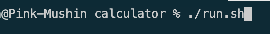

# Notes, Assignments, Group Assignments, playground for COMP 102

# HOW TO RUN
0. Download the main.c file in your machine
1. Open Terminal 
2. Navigate to the directory of downloaded main.c from terminal eg: cd Downloads/main.c
3. Execute this script -->>. ./run.sh

4. Feel free to play around..
5. Cookies !! 

## Notes
### C compilation process -- C# comparison
Coming from a C# background, the C compilation model can feel like stepping back into manual transmission!
In C#, dotnet build or Roslyn automatically finds all your .cs files, reads references, and packages everything into an assembly (a .dll or .exe). In C, the compiler has no concept of a "project" or "workspace." It only knows about the exact files you pass to it on the command line.
Here is how C compilation actually works under the hood, followed by how to build a folder full of C files and write a clean script for it.
1. How Building Works in C vs. C#
In C#, compilation and linking happen in one seamless step managed by the framework. In C, it is a two-phase process:
          Phase 1: Compilation                    Phase 2: Linking
          (Every .c -> .o / .obj)                (Combine into .exe)

  file1.c  ───> gcc -c ───> file1.o ──┐
  file2.c  ───> gcc -c ───> file2.o ──┼───> gcc *.o ───> final_program
  main.c   ───> gcc -c ───> main.o  ──┘
Phase 1: Compiling (.c → .o)
Each .c file is compiled completely independently into an object file (machine code, usually .o on macOS/Linux or .obj on Windows).
Header files (.h) are literally copy-pasted into the .c file by the preprocessor before compilation. They act like C# interface definitions or method signatures—telling the compiler, "Hey, a function with this signature exists somewhere; trust me for now."
Phase 2: Linking
The linker takes all those individual .o files, stitches them together, connects function calls to their real implementations, and outputs a single executable file.
2. Building Multiple .c Files in a Folder
If you have a folder with main.c, user.c, task.c, utils.c, etc., you have two ways to compile them:
Method A: Single-Command Compilation (Quick & Easy)
You pass all .c files directly to gcc:
Bash
gcc -Wall -Wextra -Iinclude src/*.c -o bin/app
src/*.c expands to every .c file inside the src directory.
-Iinclude tells GCC where to find your .h header files.
-Wall -Wextra enables helpful compiler warnings (similar to C# compiler warnings).
-o bin/app names the resulting executable file.
Method B: Two-Step Compilation (Faster Rebuilds for Large Projects)
For bigger projects, compiling everything from scratch every time takes too long. You compile each file to a .o file, then link them together:
Bash
# 1. Compile each source file into an object file (-c flag means "compile only, do not link")
gcc -Wall -Iinclude -c src/main.c -o build/main.o
gcc -Wall -Iinclude -c src/user.c -o build/user.o
gcc -Wall -Iinclude -c src/task.c -o build/task.o

# 2. Link all object files into the final binary
gcc build/*.o -o bin/app
3. The Modern run.sh Script
Here is a robust shell script for your workspace that creates required output directories, compiles all .c files dynamically (no matter how many you add), and executes the result:
Bash
#!/usr/bin/env bash
set -euo pipefail

# 1. Ensure script runs from project root
ROOT_DIR="$(cd "$(dirname "$0")" && pwd)"
cd "$ROOT_DIR"

# 2. Create output directories if they don't exist
mkdir -p bin build

# 3. Find and compile ALL .c files dynamically
#    -Iinclude tells gcc to look in the 'include' folder for .h files
echo "Building project..."
gcc -Wall -Wextra -g -Iinclude src/*.c -o bin/app

echo "Build successful! Running application..."
echo "----------------------------------------"

# 4. Execute the application
./bin/app
C# vs. C Mental Model Summary
Concept	C#	C
Source Files	.cs	.c
Interfaces / Signatures	interface / public methods	.h (Header files)
Intermediate Output	.dll (IL / Bytecode)	.o / .obj (Native Machine Code)
Project Configuration	.csproj / MSBuild	Makefile / CMake / Shell Scripts
Compilation Tool	dotnet build / Roslyn	gcc / clang / msvc

### Switch & local scope variable

Add Braces {} to create a local scope for each case (Recommended)
By adding {} around a case block, you create an isolated scope for that branch—just like in C#.
C
switch (program_number)
{
    case 1: 
    {   // <-- Start isolated scope
        printf("Program 1: This program takes three numbers...\n");
        int a, b, c;
        printf("Enter 3 numbers: ");
        scanf("%d %d %d", &a, &b, &c);

        int output = first_logic(a, b, c);
        printf("Logic (a + b - c): %d\n", output);
        break;
    }   // <-- End isolated scope

    case 2: 
    {   // <-- Start isolated scope (now 'a', 'b', 'c', 'output' are fresh!)
        printf("Program 2: This program takes three numbers...\n");
        int a, b, c;
        printf("Enter 3 numbers: ");
        scanf("%d %d %d", &a, &b, &c);

        int output = second_logic(a, b, c);
        printf("Logic (b + c - a):\nOutput: %d\n", output);
        break;
    }   // <-- End isolated scope
}
Solution B: Declare variables once before the switch
If the cases use variables with the exact same names and types, you can declare them once at the top of the outer block:
C
int a, b, c, output; // Declare once for the whole switch block

switch (program_number)
{
    case 1:
        printf("Enter 3 numbers: ");
        scanf("%d %d %d", &a, &b, &c);
        output = first_logic(a, b, c); // Re-use 'output'
        printf("Logic (a + b - c): %d\n", output);
        break;

    case 2:
        printf("Enter 3 numbers: ");
        scanf("%d %d %d", &a, &b, &c);
        output = second_logic(a, b, c); // Re-use 'output'
        printf("Logic (b + c - a): %d\n", output);
        break;
}

### What is #define?
In C, lines starting with # are Preprocessor Directives.
Before your code is actually compiled into executable machine code, a hidden program called the Preprocessor runs a simple Find & Replace across your whole file.
When you write #define MAX_SIZE 10, you are telling C:
"Every time you see MAX_SIZE in my code, literally copy-paste 10 in its place."

### Scope & Lifetime of auto
What is the lifetime of a variable declared with auto?
Answer: B) Till the function or block {} in which it is declared completes execution.
Explanation: In C, every standard variable you declare inside a function (like int x = 5;) is automatically an auto (automatic) variable by default!
When the function starts, memory is created on the Stack. When the function hits its closing bracket }, that memory is destroyed immediately.